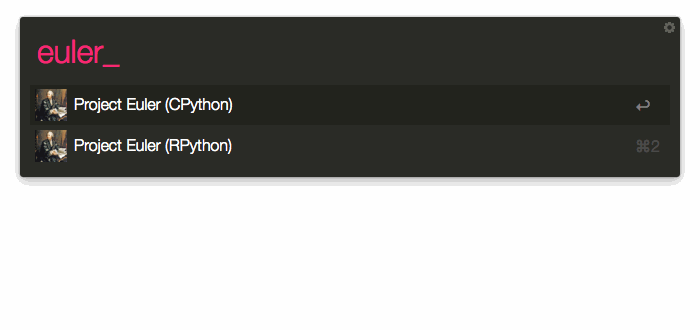

# Alfred-RWorkflow

A [RPython][rpython]-compatible helper library for authors of workflows for [Alfred 2][alfred].

## What Is This?
Alfred can be extended with workflows written in different scripting languages such as [Python][python] or [Ruby][ruby].
These scripts need to be fast in order to keep Alfred's UI responsive. I wanted to play around with RPython which is a subset
of Python, so I decided to write a helper library similar to [Alfred-Workflow](alfred-workflow). With the RPython toolchain
it is possible to translate a RPython program into C which can then be compiled to produce an executable.

## Demo

For demonstration purposes, I put together a workflow that solves four problems from [Project Euler][euler]:



[Try it out yourself!][latest]

## Requirements
You need [pypy/pypy][pypy] for building your workflows.

## Building
```bash
[path to pypy repository]/rpython/bin/rpython demo.py
```

## Benchmarks
| Input       | CPython                                 | RPython                               |                  
| -----------:|:---------------------------------------:|:-------------------------------------:|
| 10          | u: 0.01s s: 0.01s cpu: 91% t: 0.026     | u: 0.00s s: 0.00s cpu: 56% t: 0.004   |
| 100         | u: 0.01s s: 0.01s cpu: 91% t: 0.026     | u: 0.00s s: 0.00s cpu: 57% t: 0.004   |
| 1000        | u: 0.02s s: 0.01s cpu: 92% t: 0.028     | u: 0.00s s: 0.00s cpu: 59% t: 0.004   |
| 10000       | u: 0.04s s: 0.01s cpu: 95% t: 0.047     | u: 0.00s s: 0.00s cpu: 68% t: 0.005   |
| 100000      | u: 0.35s s: 0.01s cpu: 98% t: 0.368     | u: 0.03s s: 0.00s cpu: 93% t: 0.037   |
| 1000000     | u: 6.85s s: 0.06s cpu: 99% t: 6.929     | u: 0.67s s: 0.01s cpu: 99% t: 0.685   |
| 10000000    | u: 161.77s s: 1.12s cpu: 99% t: 2:43.36 | u: 17.24s s: 0.11s cpu: 99% t: 17.409 |

[alfred]: http://www.alfredapp.com/
[alfred-workflow]: http://www.alfredapp.com/
[euler]: https://projecteuler.net
[latest]: https://github.com/fniephaus/alfred-rworkflow/releases/latest/
[pypy]: https://bitbucket.org/pypy/pypy
[python]: https://www.python.org/
[rpython]: http://rpython.readthedocs.org/
[ruby]: https://www.ruby-lang.org/
